# NyxMap Card — visual guide

Every option in the [configuration reference](../README.md#configuration-reference),
shown running. Each screenshot below is the card rendered in a **real Home
Assistant instance** against real entities — see
[How these were produced](#how-these-were-produced) at the bottom.

Options that have no visual result of their own (`card_size`, `plugins`,
`z_index_offset`, …) are documented in the
[README tables](../README.md#configuration-reference) rather than pictured here.

## Contents

- [The card](#the-card)
- [Base map: styles, theme, projection](#base-map-styles-theme-projection)
- [Markers](#markers)
- [Circles](#circles)
- [History trails](#history-trails)
- [Clustering](#clustering)
- [GeoJSON](#geojson)
- [Raster overlays: tile layers and WMS](#raster-overlays-tile-layers-and-wms)
- [Layer switcher](#layer-switcher)
- [Visual editor](#visual-editor)
- [How these were produced](#how-these-were-produced)

## The card

The default card: entity markers on a vector base style, with MapLibre's
zoom/compass control and the card's own **Reset focus** and **Toggle grouping**
buttons stacked beneath it in the top-right.

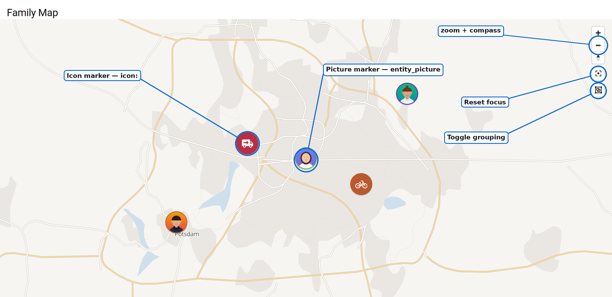

```yaml
type: custom:nyxmap-card
title: Family Map
x: 13.405
y: 52.52
zoom: 9.2
height: 700
projection: mercator
entities:
  - person.alice
  - person.bob
  - person.carol
  - device_tracker.delivery_van
  - device_tracker.cargo_bike
```

The same card as a Lovelace dashboard sees it — nothing about it is special-cased,
it is an ordinary custom card:

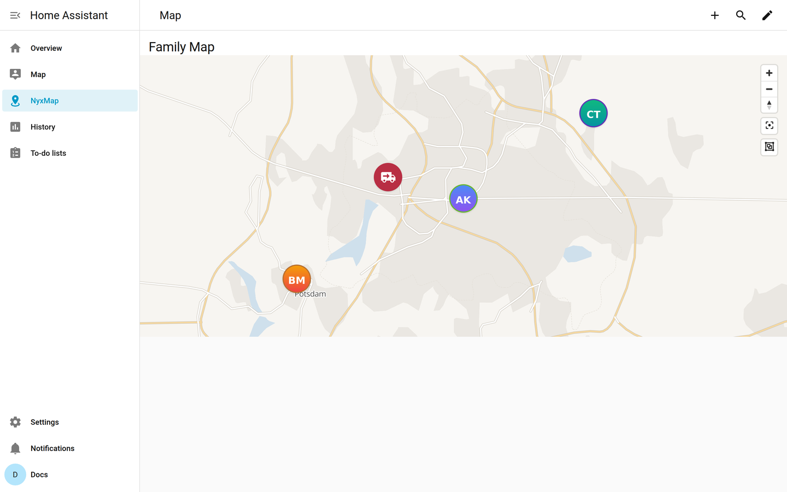

## Base map: styles, theme, projection

### `theme_mode`

`map_style` and `map_style_dark` are separate MapLibre style JSON URLs.
`theme_mode` picks between them — `auto` (the default) follows the browser's
`prefers-color-scheme`.

Note that `theme_mode` swaps the **map style only**. The card chrome around it
(header, background) follows Home Assistant's own theme, which is why the header
stays light in the right-hand shot.

| `theme_mode: light` | `theme_mode: dark` |
|---|---|
| 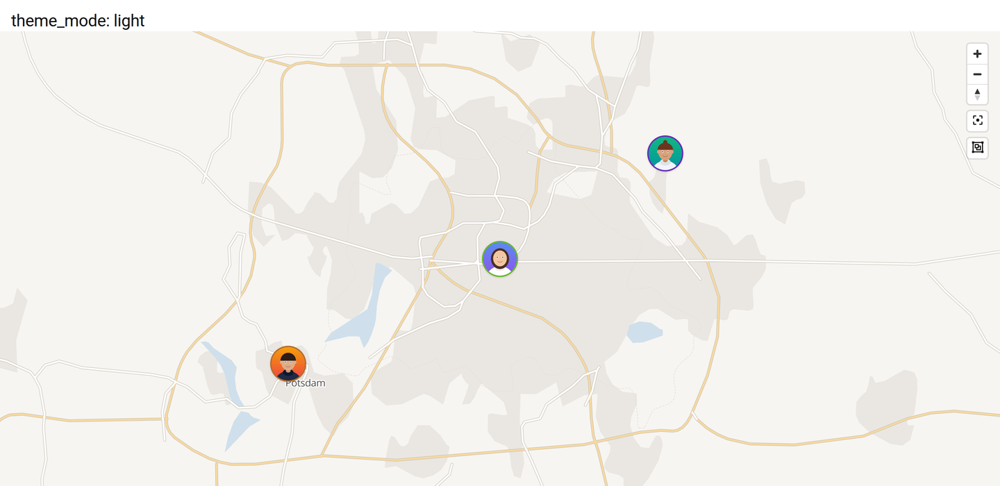 | 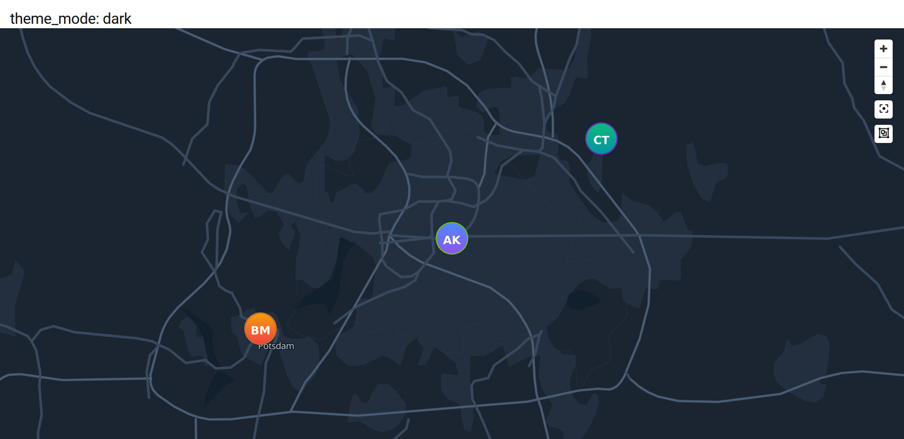 |

```yaml
map_style: https://tiles.openfreemap.org/styles/positron
map_style_dark: https://tiles.basemaps.cartocdn.com/gl/dark-matter-gl-style/style.json
theme_mode: auto
```

Markers survive a style swap for free — they are HTML elements living outside the
style. Anything drawn as a MapLibre source/layer (trails, circles, GeoJSON, raster
overlays) is re-added automatically after every swap.

### `projection`

MapLibre's 3D globe is the default, and the most visible thing the card buys over
a Leaflet-based map. `projection: mercator` is the one-line opt-out.

| `projection: globe` (default) | `projection: mercator` |
|---|---|
| 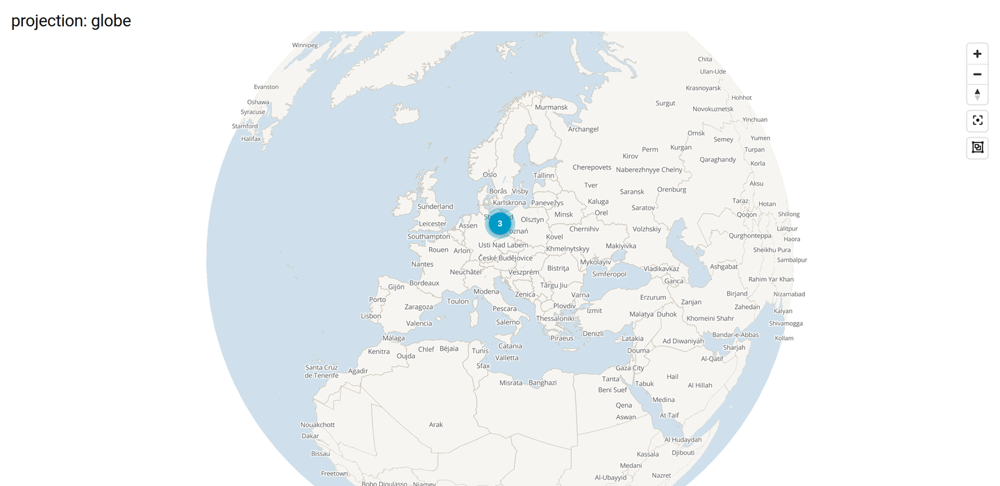 | 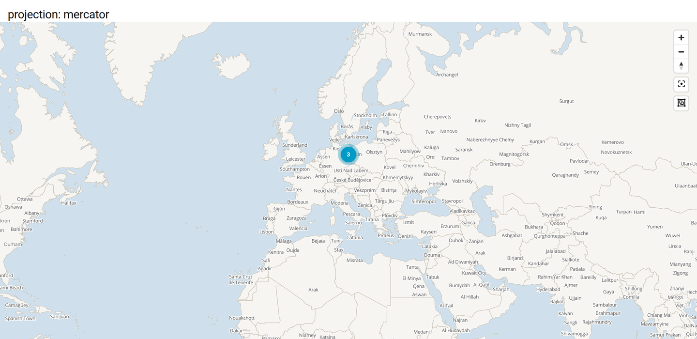 |

```yaml
projection: globe   # or: mercator
zoom: 2.4
```

## Markers

### `display`

`marker` (the default) walks a fallback chain: the entity's **picture**
(`entity_picture` or a `picture:` override), then its **icon**, then its
**initials**. `icon` skips the picture even when one exists. `state` renders the
entity's current state value, widening into a pill for longer values.

All four are below, left to right — Alice has an `entity_picture`, Bob is forced
to an icon, Dave has neither so falls through to initials, and the river gauge
renders its own state:

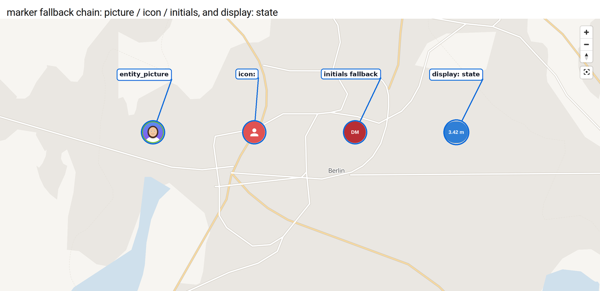

```yaml
entities:
  - entity: person.alice
    display: marker          # has entity_picture → picture marker
  - entity: person.bob
    display: icon            # skip the picture even though one exists
    icon: mdi:account
    color: '#e05252'
  - entity: person.dave
    display: marker          # no picture, no icon → initials ("DM")
  - entity: sensor.river_gauge
    display: state           # render the state value itself
    color: '#2f7fd6'
```

`picture`, `icon`, `label`, `color` and `size` all override what the marker shows;
`fixed_x`/`fixed_y` pin it to a fixed position instead of reading the entity's
`latitude`/`longitude`.

## Circles

### `show_accuracy_circles`

On by default, matching Home Assistant's own map: any entity with a
`gps_accuracy` (or `radius`) attribute gets a circle sized from it. The two
phones below differ only in their reported accuracy.

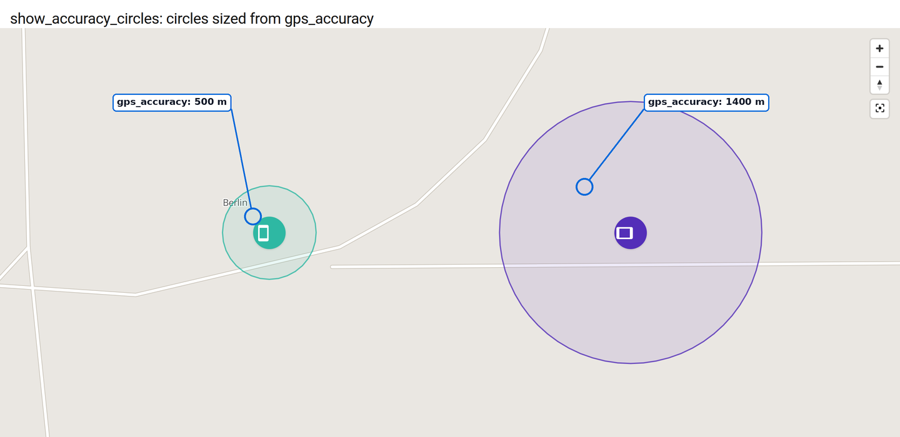

```yaml
show_accuracy_circles: true    # default
entities:
  - device_tracker.phone_good_fix   # gps_accuracy: 500
  - device_tracker.phone_poor_fix   # gps_accuracy: 1400
```

### Per-entity `circle:`

An explicit `circle:` object controls radius, color and fill.

> **Watch the `source`.** The default `source: auto` *prefers the entity's
> `gps_accuracy`/`radius` attribute* and only falls back to the configured
> `radius`. So on an entity that reports `gps_accuracy`, a bare
> `circle: {radius: 4000}` draws the accuracy circle, not a 4 km one. Use
> `source: config` to force the configured radius.

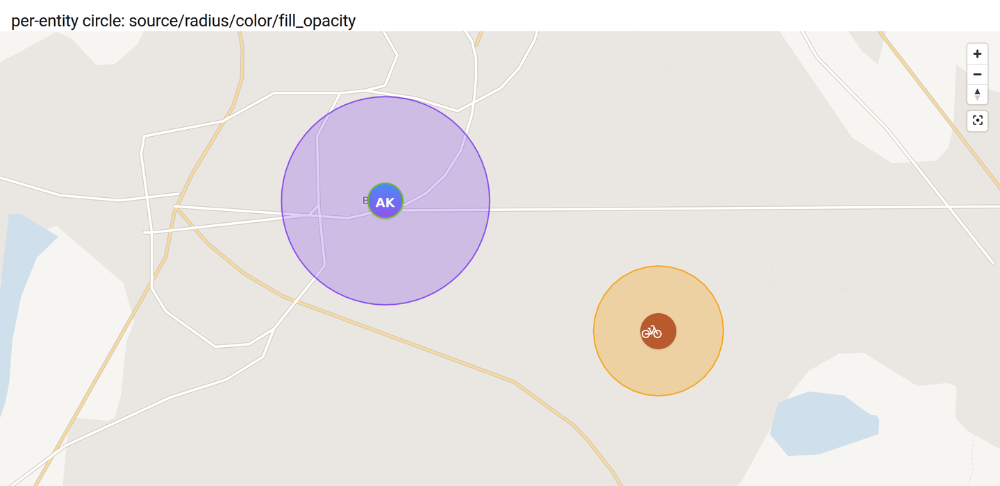

```yaml
entities:
  - entity: person.alice
    circle:
      source: config     # ignore gps_accuracy, use the radius below
      radius: 4000
      color: '#7c3aed'
      fill_opacity: 0.25
  - entity: device_tracker.cargo_bike
    circle: { source: config, radius: 2500, color: '#f59e0b', fill_opacity: 0.30 }
```

## History trails

Setting `history_start` on an entity draws its recent positions as a trail.
The window may be relative (`1 hour ago`) or absolute/ISO; a relative window keeps
tracking real time on a dashboard left open, rather than freezing at page load.

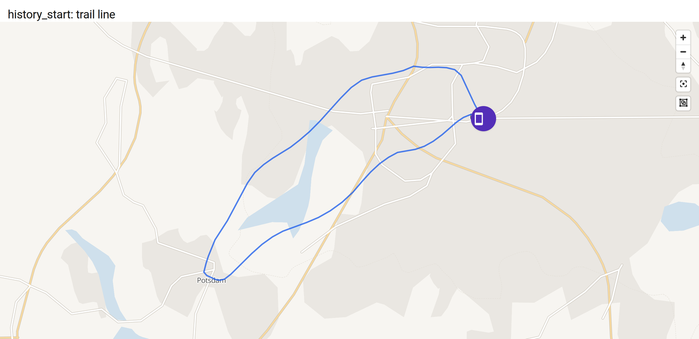

```yaml
entities:
  - entity: device_tracker.alice_phone
    history_start: 1 hour ago
    history_line_color: '#2563eb'
```

`history_show_dots` adds a dot per recorded position — useful for seeing sampling
density rather than just the path.

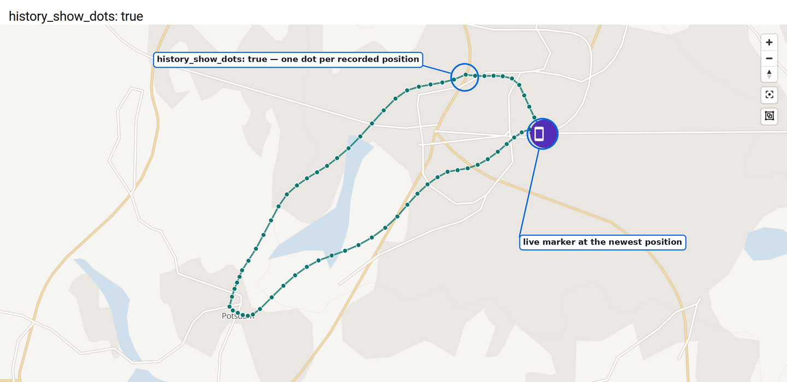

```yaml
history_show_dots: true    # card-level, applies to every entity's history
history_show_lines: true   # default; set false for dots only
```

## Clustering

`cluster_markers` is on by default. Entities collapse into a numbered bubble
**when their marker circles actually overlap on screen** — not at a fixed radius —
and animate as they merge and split. `cluster_max_zoom` (default `14`) caps the
zoom above which clustering stops entirely.

| `cluster_markers: true` (default) | `cluster_markers: false` |
|---|---|
| 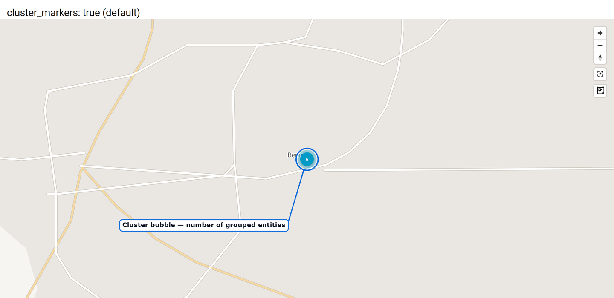 | 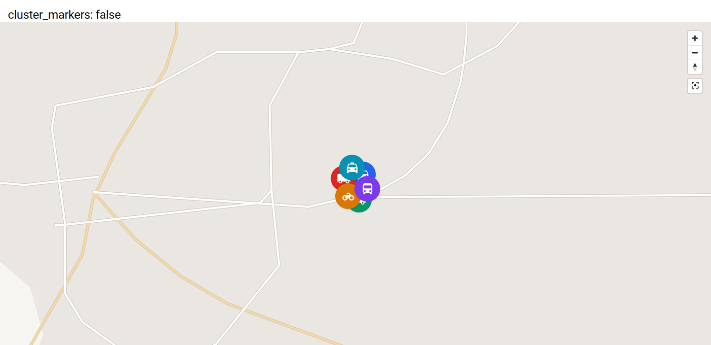 |

```yaml
cluster_markers: true
cluster_max_zoom: 14
```

The **Toggle grouping** map button (top-right, beneath Reset focus) flips this at
runtime, and only appears while clustering is enabled.

> Clustering absorbs the markers it groups, and an absorbed entity's accuracy
> circle goes with it. If you are trying to show circles on entities that sit
> close together, set `cluster_markers: false`.

## GeoJSON

`geojson:` renders a geometry straight out of an entity attribute. Points, lines
and polygons are each dispatched to the right MapLibre layer type automatically —
including `MultiPolygon`, drawn below as two separate flood zones from one entity.

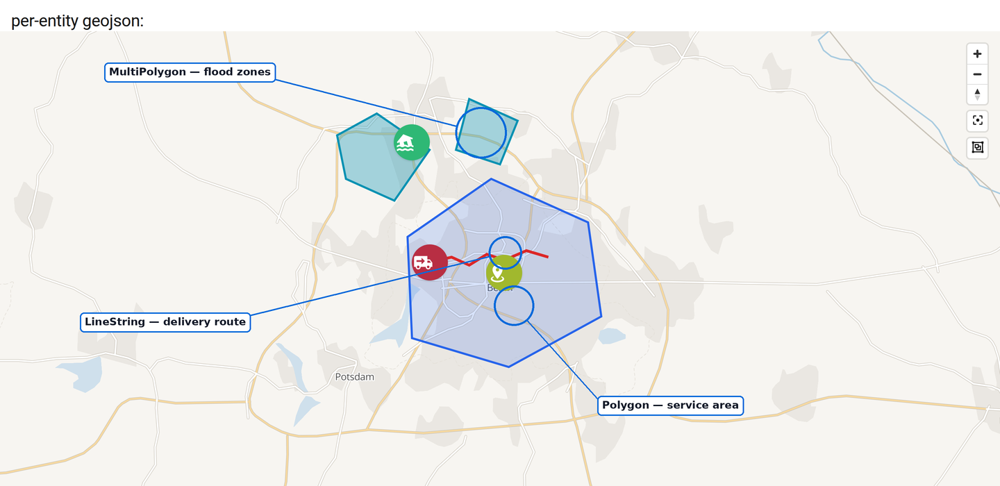

```yaml
entities:
  - entity: sensor.delivery_service_area
    geojson:
      attribute: service_area     # Polygon
      color: '#2563eb'
      fill_opacity: 0.18
      weight: 3
  - entity: device_tracker.delivery_van
    geojson: { attribute: route, color: '#dc2626', weight: 4 }   # LineString
  - entity: sensor.flood_warning
    geojson: { attribute: geo_location, color: '#0891b2', fill_opacity: 0.35 }
```

Add `hide_marker: true` to draw only the shape and suppress the entity's own marker.

## Raster overlays: tile layers and WMS

`tile_layers` layers XYZ raster tiles over the vector base style — weather radar
being the usual case. `options.opacity` keeps the base map readable underneath,
and `options.maxzoom` stops the card requesting tiles the provider doesn't have.

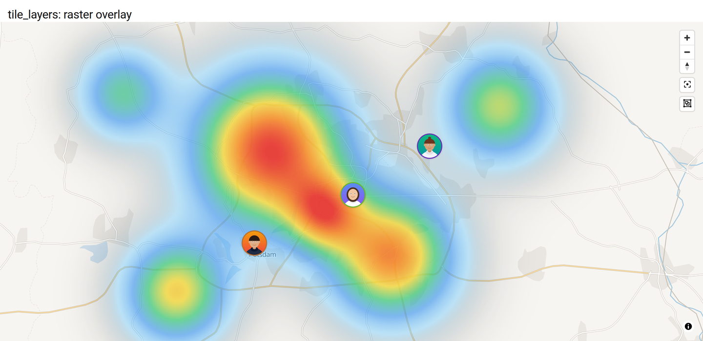

```yaml
tile_layers:
  - url: /local/radar/{z}/{x}/{y}.png
    attribution: Demo radar
    options:
      opacity: 0.55
      maxzoom: 11
```

`wms:` takes the bare service endpoint instead, with the GetMap parameters under
`options`. Requests are built around MapLibre's own `{bbox-epsg-3857}` token, so
they load like any other raster source.

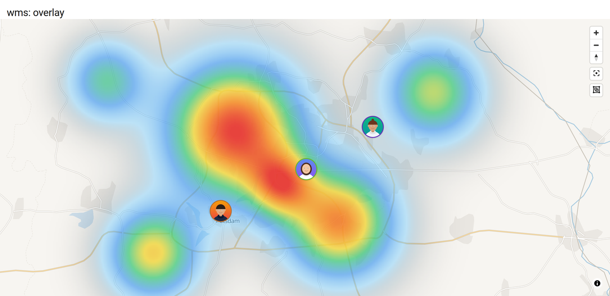

```yaml
wms:
  - url: http://example.local/wms
    attribution: Demo WMS
    options:
      layers: radar
      format: image/png
      transparent: true
      opacity: 0.55
```

Both accept either a single object or a list, and both support
`{{ states('entity_id') }}` templating in the `url`, re-resolved live as that
entity's state changes.

## Layer switcher

`layer_switcher: true` adds a panel — its button sits in the top-right, beneath
the other controls. It offers the base styles as a radio group and every overlay
as a checkbox, grouped by kind (tile layers, clustering, accuracy circles, GeoJSON,
history, plus a section per plugin group).

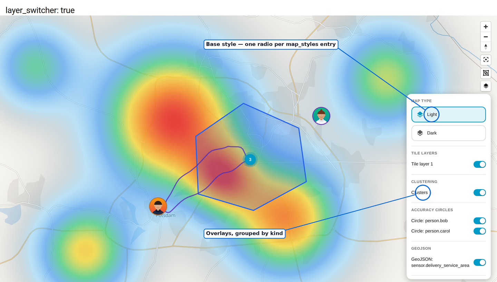

```yaml
layer_switcher: true
```

`map_styles` replaces the generic Light/Dark pair with your own named base styles.
Each entry may carry its own `max_zoom`/`min_zoom`, for styles whose real coverage
differs.

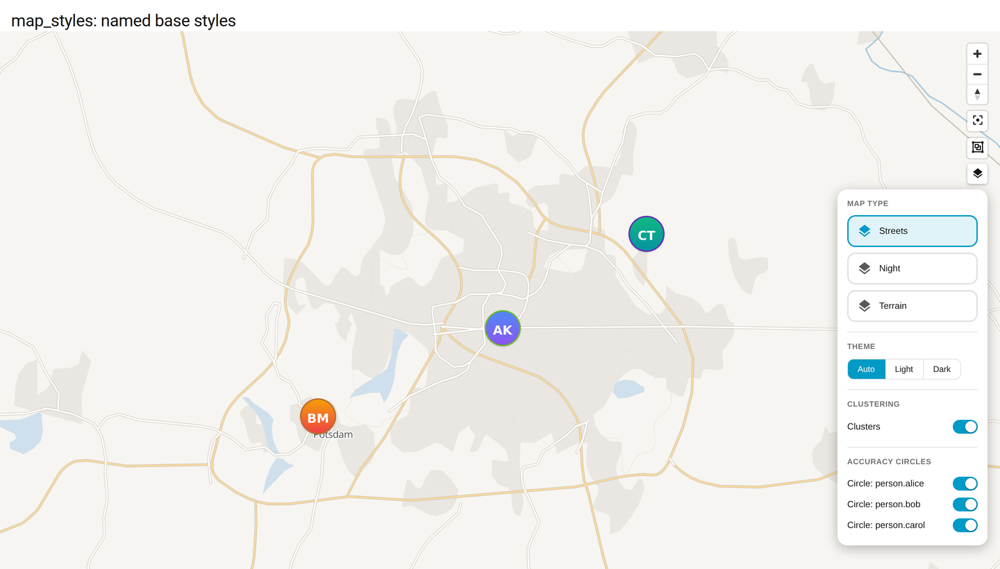

```yaml
layer_switcher: true
map_styles:
  - name: Streets
    map_style: https://tiles.openfreemap.org/styles/positron
    map_style_dark: https://tiles.basemaps.cartocdn.com/gl/dark-matter-gl-style/style.json
  - name: Night
    map_style: https://tiles.basemaps.cartocdn.com/gl/dark-matter-gl-style/style.json
  - name: Terrain
    map_style: https://tiles.openfreemap.org/styles/positron
    max_zoom: 12
```

An overlay's on/off state survives it disappearing and coming back — a trail whose
latest fetch was too short, or a circle absorbed by clustering, returns hidden if
that is how you left it.

## Visual editor

**Edit card** on a NyxMap card gives a form rather than raw YAML, with a live
preview of the real card beside it.

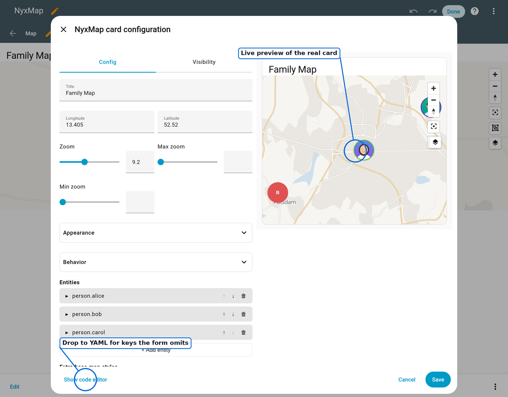

Each entity row expands to the full per-entity option set — display, picture, icon,
label, color, size, fixed position, z-index, fit behavior, history window and line
color, and an accuracy-circle toggle.

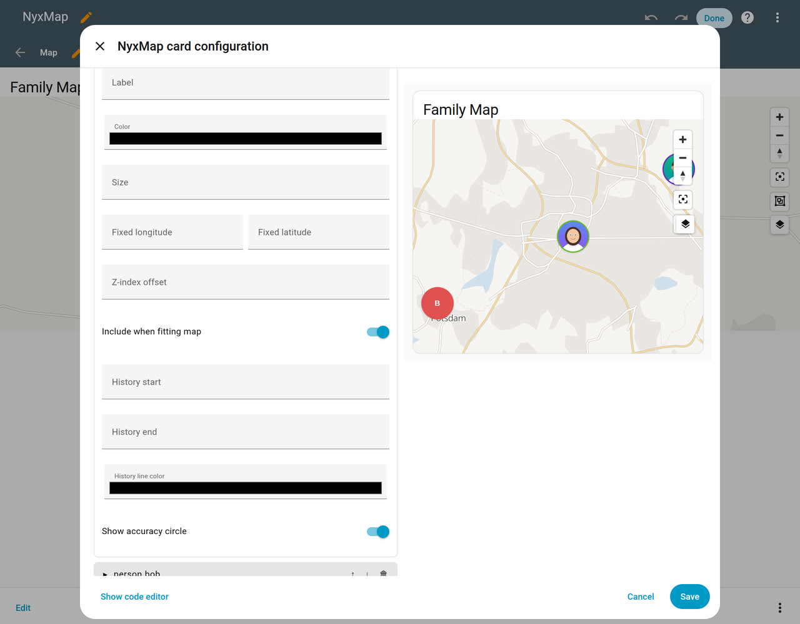

`geojson`, `tile_layers`, `wms` and `plugins` are not in the visual editor, nor is
per-field circle editing — use **Show code editor** for those. Keys the form does
not cover are preserved untouched when you save.

## How these were produced

Every screenshot is the real card in a real instance, not a mockup:

- **Home Assistant Core 2026.2.3**, freshly onboarded, with the built
  `dist/nyxmap-card.js` registered as a Lovelace resource (`/local/nyxmap-card.js`)
  exactly as the [manual install](../README.md#manual) describes.
- **Real entities** — `person.*`, `device_tracker.*` and `sensor.*` with real
  `latitude`/`longitude`/`gps_accuracy` attributes.
- **Real history** — the trail screenshots come from positions genuinely recorded
  by HA's recorder and read back through the same `history/history_during_period`
  websocket call the card uses in production.
- **Real map data** — coastlines, borders, urban areas, roads, rivers, lakes and
  place labels are [Natural Earth](https://www.naturalearthdata.com/) vector data,
  served as a self-contained MapLibre style.

One deliberate difference from a default install: the basemap is that **local
offline style**, not the card's default OpenFreeMap/CARTO styles, because the
capture environment has no egress to those hosts. It is genuine geography rather
than a placeholder, but it is generalized — there is no building- or street-level
detail, which is why the screenshots are framed at regional zooms. A default
install pointed at the real style URLs shows far more detail at high zoom; nothing
else about the card's behavior differs.

The radar imagery in the tile-layer and WMS screenshots is synthetic, generated
locally to give those overlays something real to load (the WMS one is served by an
actual GetMap endpoint).
